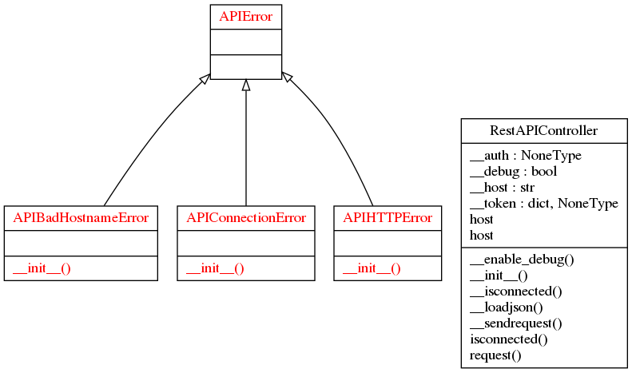

apicontroller
## Description:
`apicontroller` is a Python package to manage REST API requests.
We provide examples to use it.

## Setup:
```shell
$ git clone https://github.com/francois-le-ko4la/rest-api-controller.git
$ cd rest-api-controller
$ make install
```

## Test:
```shell
$ make test
```

## Use:

* Import the package
```python
from apicontroller import RestAPIController
```

* API wo authentication using tests
```python
import time


#init the Class
my_api = RestAPIController(host="http://api.open-notify.org",
    DEBUG=True)

# send the request
result = my_api.request("GET", "/iss-now.json")

# test result
if result is None:
    exit()

# use the result
print(result)
print(time.ctime(int(result['timestamp'])))
print(result['iss_position']['longitude'] + ", " +
    result['iss_position']['latitude'])
```

* API OAuth1 (username / token) - GITHUB
```python
my_github_api = RestAPIController(
    host = "https://api.github.com",
    auth = ("*** USERNAME ***", "*** TOKEN ***"),
    DEBUG= True
    )
my_github_api.request("GET", "/user")
```

* OAuth Token - Facebook
```python
my_fb_api = RestAPIController(
    token=("OAuth", "*** TOKEN ***"),
    host = "https://graph.facebook.com",
    DEBUG = True
    )
my_fb_api.request("GET", "/v2.12/me/taggable_friends",
    {'fields':'id, name, picture.width(500).height(500).type(large)',
    'limit':'5000'})
```

## Project structure

```
.
├── apicontroller
│   ├── __about__.py
│   ├── controller.py
│   ├── exceptions.py
│   └── __init__.py
├── last_check.log
├── LICENSE
├── Makefile
├── pictures
│   ├── classes_apicontroller.png
│   └── packages_apicontroller.png
├── README.md
├── runtime.txt
├── setup.cfg
├── setup.py
└── tests
    ├── test_doctest.py
    ├── test_pycodestyle.py
    └── use_it.py
```

## Todo:

- [X] Create the project
- [X] Write code and tests
- [X] Test installation and requirements (setup.py and/or Makefile)
- [X] Test code
- [X] Validate features
- [X] Write Doc/stringdoc
- [X] Run PEP8 validation
- [X] Clean & last check
- [X] Release
- [X] improve (un)install
- [X] manage global var
- [X] Release: 0.2.0
- [X] improve package var
- [X] improve exceptions
- [X] Release: 0.3.0


## License

This package is distributed under the [GPLv3 license](./LICENSE)
### Runtime

```

python-3.6.x


```

### UML Diagram



### Objects

[RestAPIController()](#restapicontroller)<br />
[@Property RestAPIController.host](#property-restapicontrollerhost)<br />
[RestAPIController.isconnected()](#restapicontrollerisconnected)<br />
[RestAPIController.request()](#restapicontrollerrequest)<br />
[APIError()](#apierror)<br />
[APIConnectionError()](#apiconnectionerror)<br />
[APIHTTPError()](#apihttperror)<br />
[APIBadHostnameError()](#apibadhostnameerror)<br />


#### RestAPIController()
```python
class RestAPIController(object):
```

```
My REST API Controller

Use:
    >>> # oups
    >>> my_api = RestAPIController(host="http://pz.g")
    >>> print(my_api.request("GET", "/iss-now.json"))
    Traceback (most recent call last):
    ...
    apicontroller.exceptions.APIConnectionError: "http://pz.g" unreachable!
    >>> # oups 2
    >>> my_api = RestAPIController(host="http://api.open-notify.org")
    >>> result = my_api.request("GREP", "/iss-now.json")
    Traceback (most recent call last):
    ...
    apicontroller.exceptions.APIHTTPError: Client Error - {'method': 'GREP', 'url': 'http://api.open-notify.org/iss-now.json'}.
    >>> # oups 3
    >>> my_api = RestAPIController(host="api.open-notify.org")
    Traceback (most recent call last):
    ...
    apicontroller.exceptions.APIBadHostnameError: "api.open-notify.org" is not validated!
    >>> my_api = RestAPIController(host="http://api.open-notify.org")
    >>> result = my_api.request("GET", "/iss-now.json")
    >>> result['message']
    'success'
```

##### @Property RestAPIController.host
```python
@property
def RestAPIController.host(self):
```
> <br />
> None<br />
> <br />
##### RestAPIController.isconnected()
```python
@__isconnected
def RestAPIController.isconnected(self):
```
> <br />
> Provide a link status between this script & REST API server<br />
> This function is decorated by @__isconnected.<br />
> If the link is down, then decorator will change the value.<br />
> <br />
> <b>Args:</b><br />
> &nbsp;&nbsp;&nbsp;&nbsp;&nbsp;&nbsp;&nbsp;&nbsp;&nbsp;&nbsp;&nbsp;&nbsp;&nbsp;&nbsp;&nbsp;  None<br />
> <br />
> <b>Returns:</b><br />
> &nbsp;&nbsp;&nbsp;&nbsp;&nbsp;&nbsp;&nbsp;&nbsp;&nbsp;&nbsp;&nbsp;&nbsp;&nbsp;&nbsp;&nbsp;  True<br />
> <br />
##### RestAPIController.request()
```python
@__loadjson
@__sendrequest
@__isconnected
@__enable_debug
def RestAPIController.request(self, cur_method, cur_path, cur_args=None):
```
> <br />
> Provide all arguments to request.<br />
> This function is decorated by __enable_debug,<br />
> __isconnected, __sendrequest, and __loadjson<br />
> <br />
> <b>Args:</b><br />
> &nbsp;&nbsp;&nbsp;&nbsp;&nbsp;&nbsp;&nbsp;&nbsp;&nbsp;&nbsp;&nbsp;&nbsp;&nbsp;&nbsp;&nbsp;  cur_method (str): "GET", "PUT" ...<br />
> &nbsp;&nbsp;&nbsp;&nbsp;&nbsp;&nbsp;&nbsp;&nbsp;&nbsp;&nbsp;&nbsp;&nbsp;&nbsp;&nbsp;&nbsp;  cur_path (str): url = host+path<br />
> &nbsp;&nbsp;&nbsp;&nbsp;&nbsp;&nbsp;&nbsp;&nbsp;&nbsp;&nbsp;&nbsp;&nbsp;&nbsp;&nbsp;&nbsp;  cur_args (dict): HTTP args<br />
> <br />
> <b>Returns:</b><br />
> &nbsp;&nbsp;&nbsp;&nbsp;&nbsp;&nbsp;&nbsp;&nbsp;&nbsp;&nbsp;&nbsp;&nbsp;&nbsp;&nbsp;&nbsp;  dict(): request's args send to decorators<br />
> <br />
#### APIError()
```python
class APIError(Exception):
```

```
Generic exception for apicontroller
```

#### APIConnectionError()
```python
class APIConnectionError(APIError):
```

```
None
```

#### APIHTTPError()
```python
class APIHTTPError(APIError):
```

```
None
```

#### APIBadHostnameError()
```python
class APIBadHostnameError(APIError):
```

```
None
```
